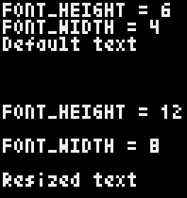

# Learning Pyxel

This repository contains the test programs I am writing while I learn how to create simple games using Pyxel. I also keep notes about what I learn if I feel I can expand on the existing documentation.

## Tutorials

The order in which the Pyxel developer [recommends](https://discord.com/channels/697925198992900106/697925198992900109/930086207239622666) working through the [Pyxel examples](https://github.com/kitao/pyxel#try-pyxel-examples) is 1, 5, 3, 4, 2, 9, and 10.

[CaffeinatedTech](https://twitter.com/CaffeinatedTech) produced a [2-hour video walking through the basics of Pyxel](https://youtu.be/Qg16VhEo2Qs). It is available on YouTube.

Jorge Rodriguez's [*Math for Game Developers*](https://www.youtube.com/watch?v=-Fn4atv2NsQ&list=PLW3Zl3wyJwWOpdhYedlD-yCB7WQoHf-My&index=26) videos.

Brandon James Greer's [*Getting started in pixel art*](https://www.youtube.com/playlist?list=PLxfQIomHccxvoTON6hXhfZyAUdFXd-z1P) videos.

## Text size

Text size is hard-coded and cannot be changed. Each letter and number is six pixels high and four pixels wide.

There are two attributes in the Pyxel class that help programmers work with the existing text size: `FONT_WIDTH` and `FONT_HEIGHT`. These help programmers position text reletive to other text on the screen but assigning new values to them does not change the size of text on the screen.

If you need to have different sizes of text, or want text that looks different than the startndard font supported by Pyxel, consider the following two examples:

* You could create your own text phrases in an image and copy each phrase to the screen like in the [*Megaball* game](https://github.com/helpcomputer/megaball)
* Or, consider rendering text with custom-sized blocks matched with each letter's pixels, as [proposed by Cereale](https://discord.com/channels/697925198992900106/698548784166207519/785495391026151444) in their [*Platformer* game](https://gitlab.com/Cereale/pyxel-jam-platformer)  

### Text test program

I created a small program that demonstrates that text size is not affected by the `FONT_WIDTH` and `FONT_HEIGHT` attributes. Copy and run the below program:

```python
import pyxel

pyxel.init(66, 70, title='Text',quit_key=pyxel.KEY_Q)

# Display text using the default text size
# I am using the FONT_HEIGHT to calculate the y-axis on
# the screen where I draw each line of text
pyxel.text(1, 1,f'FONT_HEIGHT = {pyxel.FONT_HEIGHT}', 7)
pyxel.text(1, 1 + (1 * pyxel.FONT_HEIGHT),f'FONT_WIDTH = {pyxel.FONT_WIDTH}', 7)
pyxel.text(1, 1 + (2 * pyxel.FONT_HEIGHT),'Default text',7)

# Change text size attributes
pyxel.FONT_HEIGHT = 12
pyxel.FONT_WIDTH = 8

# See that line spacing (based on calculation using FONT_HEIGHT)
# increases but the text size remains the same
pyxel.text(1, 1 + (3 * pyxel.FONT_HEIGHT),f'FONT_HEIGHT = {pyxel.FONT_HEIGHT}', 7)
pyxel.text(1, 1 + (4 * pyxel.FONT_HEIGHT),f'FONT_WIDTH = {pyxel.FONT_WIDTH}', 7)
pyxel.text(1, 1 + (5 * pyxel.FONT_HEIGHT),'Resized text',7)

pyxel.show()
```

You should see the output screen shown below. Notice how the text size does not change but the spacing between lines changes because I used the `FONT_HEIGHT` attribute to calculate the number of pixels between lines.




