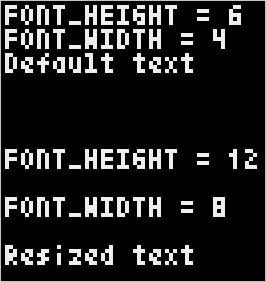
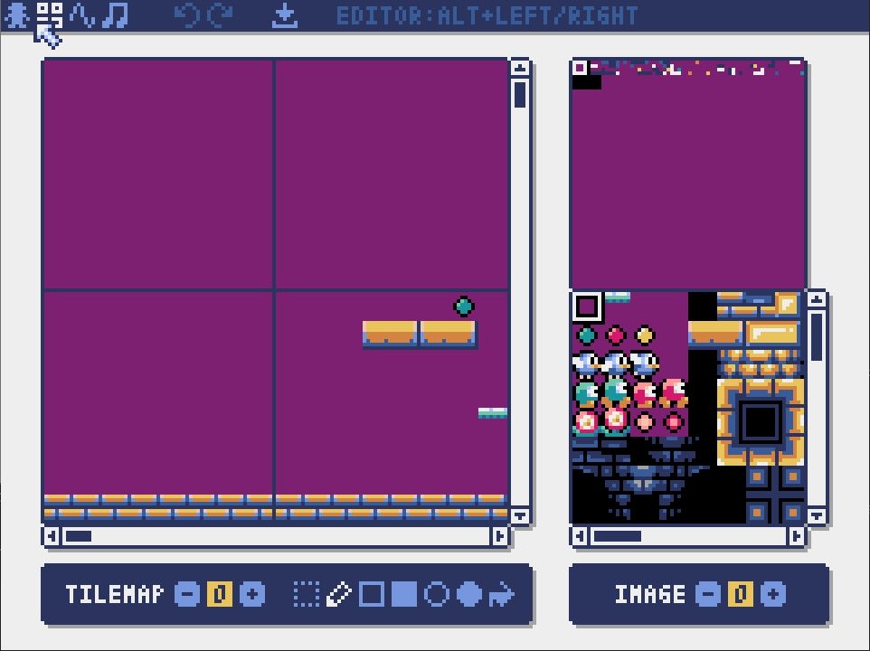

# Learning Pyxel

This repository contains the test programs I am writing while I learn how to create simple games using Pyxel. I also keep notes about what I learn if I feel I can expand on the existing documentation.

## Tutorials

The [Pyxel web page](https://github.com/kitao/pyxel#) contains everything you need to know about using Pyxel and the Pyxel resource editor, but some additional resources are listed below:

* Pyxel's developer, [Takashi Kitao](https://twitter.com/kitao), [recommends](https://discord.com/channels/697925198992900106/697925198992900109/930086207239622666) working through the [Pyxel examples](https://github.com/kitao/pyxel#try-pyxel-examples) in the following order: 1, 5, 3, 4, 2, 9, and 10.
* [Emanoel Barreiros](https://twitter.com/ebarreiros) wrote an excellent blog with nine posts about using Pyxel. The first post is in English and the remaining are in Portuguese but you can [translate](https://kinsta.com/blog/how-to-translate-a-website/) them in your web browser.
  * How to write a retro-style snake game using Pyxel
    * [Part 1](https://emanoelbarreiros.github.io/game/snake/snake-1/), [Part 2](https://emanoelbarreiros.github.io/game/snake/snake-2-pt/), [Part 3](https://emanoelbarreiros.github.io/game/snake/snake-3-pt/), [Part 4](https://emanoelbarreiros.github.io/game/snake/snake-4-pt/)
  * Implementing acceleration using Pyxel
    * [Gravity](https://emanoelbarreiros.github.io/game/gravidade/)
    * [Slingshot](https://emanoelbarreiros.github.io/game/estilingue/)
  * Collision detection using Pyxel
    * [Between circles](https://emanoelbarreiros.github.io/game/colisao_circulo/)
    * [Between rectangles](https://emanoelbarreiros.github.io/game/colisao_retangulos/)
    * [Between rectangles and circles](https://emanoelbarreiros.github.io/game/colisao_circ_rect/)
* [CaffeinatedTech](https://twitter.com/CaffeinatedTech) produced a [2-hour video walking through the basics of Pyxel](https://youtu.be/Qg16VhEo2Qs).

Some more advanced tutorials about general game development are:

* Jorge Rodriguez's [*Math for Game Developers*](https://www.youtube.com/watch?v=-Fn4atv2NsQ&list=PLW3Zl3wyJwWOpdhYedlD-yCB7WQoHf-My&index=26) videos.
* Brandon James Greer's [*Getting started in pixel art*](https://www.youtube.com/playlist?list=PLxfQIomHccxvoTON6hXhfZyAUdFXd-z1P) videos.

## Projects made with Pyxel

The following projects are available on Github so you can look through their source code and see how they were built.

* [Pyxel lander](https://pypi.org/project/pyxel-lander/): a Moon Lander clone
* [Asteroids](https://github.com/timbledum/asteroids): The classic Asteroids game made with Pyxel
* [PyxelSudoku](https://github.com/nickdelgrosso/PyxelSudoku2): Sudoku game made with Pyxel
* [Tetris and Copter](https://github.com/shivanju/pyxel-games): Simple versions of the classic Tetris game and the classic Copter game.
* [Pyxel raycast](https://github.com/danmacnaughtan/pyxel-raycast): An example of raycast rendering 
* [Python nibbles](https://github.com/CaffeinatedTech/Python_Nibbles): a simple snake game. It is the source code for the snake game developed during CaffeinatedTech's video, referred to above.
* [Pyxelext](https://github.com/bloodywing/pyxelext): Pyxel extensions. One of these extensions shows an example of using the [Pymunk](http://www.pymunk.org/en/latest/index.html) 2D physics library with Pyxel.
* [2021 A Space Odyssey](https://github.com/HB-fga/2021-A-Space-Odyssey): An example of integrating the [easymunk-physics](https://github.com/fabiommendes/easymunk) library to build a Pyxel game.

<!-- commented out because Pyxel-physics is not finished and last commit was 16 months ago. Pyxel-physics seems to have been replaced by easymunk-physics, by the same developer.
## Libraries that work with Pyxel

The following libraries add more capability to Pyxel games:

* [Pyxel physics](https://pypi.org/project/pyxel-physics/): a 2D physics library for Pyxel, based on [Pymunk](http://www.pymunk.org/en/latest/index.html).
* [Pyxel server](https://github.com/FloppiDisk/pyxel_server): An API that integrates your Pyxel games with servers for multi-player games.
-->

## Text size

Text size is hard-coded and cannot be changed. Each letter and number is six pixels high and four pixels wide.

There are two attributes in the Pyxel module that help programmers work with the existing text size: `FONT_WIDTH` and `FONT_HEIGHT`. These help programmers position text relative to other text on the screen but assigning new values to them does not change the size of text on the screen.

If you need to have different sizes of text, or want text that looks different than the standard font supported by Pyxel, consider the following two examples:

* You could create your own text phrases in an image and copy each phrase to the screen like in the [*Megaball* game](https://github.com/helpcomputer/megaball)
* Or, consider rendering text with custom-sized blocks matched with each letter's pixels, as [proposed by Cereale](https://discord.com/channels/697925198992900106/698548784166207519/785495391026151444) in their [*Platformer* game](https://gitlab.com/Cereale/pyxel-jam-platformer)  

### Text test program

I created a small program that demonstrates that text size is not affected by the `FONT_WIDTH` and `FONT_HEIGHT` attributes. Copy and run the below program:

```python
import pyxel

pyxel.init(66, 70, title='Text',quit_key=pyxel.KEY_Q)

# Display text using the default text size
# I am using the FONT_HEIGHT to calculate the y-axis on
# the screen where I draw each line of text
pyxel.text(1, 1,f'FONT_HEIGHT = {pyxel.FONT_HEIGHT}', 7)
pyxel.text(1, 1 + (1 * pyxel.FONT_HEIGHT),f'FONT_WIDTH = {pyxel.FONT_WIDTH}', 7)
pyxel.text(1, 1 + (2 * pyxel.FONT_HEIGHT),'Default text',7)

# Change text size attributes
pyxel.FONT_HEIGHT = 12
pyxel.FONT_WIDTH = 8

# See that line spacing (based on calculation using FONT_HEIGHT)
# increases but the text size remains the same
pyxel.text(1, 1 + (3 * pyxel.FONT_HEIGHT),f'FONT_HEIGHT = {pyxel.FONT_HEIGHT}', 7)
pyxel.text(1, 1 + (4 * pyxel.FONT_HEIGHT),f'FONT_WIDTH = {pyxel.FONT_WIDTH}', 7)
pyxel.text(1, 1 + (5 * pyxel.FONT_HEIGHT),'Resized text',7)

pyxel.show()
```

You should see the output screen shown below. Notice how the text size does not change but the spacing between lines changes because I used the `FONT_HEIGHT` attribute to calculate the number of pixels between lines.




## Tile map autofill

When I made my first image and then switched to the tile map editor, I was surprised to see that the background of the tile map was covered in little images. I had a tile map that looked like the one below:


Later, I found out that the default background of the tile map is made up of the first 8x8 sprite in the first image file. As an example, look at the platformer.pyxres from the [platformer.pyxres](https://github.com/kitao/pyxel/tree/main/pyxel/examples/assets) example on the Pyxel web site. You see that the first 8x8 sprite in the image file is a plain purple field.


Switching to the Tile Map function shows that tile maps fill with the sprite that is in position `0,0` in `Image(0)`. This creates an all-purple default background, as shown below.



If you do not want the tile map to autofill, leave the 8x8 sprite at location `0,0` in `Image(0)` blank.


## Why does Pyxel's documentation recommend using classes?

I was interested in Pyxel because I thought it would be a great tool to introduce my child to Python programming. I did not want to start in the "deep end" with classes and object-oriented programming. But, the Pyxel documentation [recommends that you wrap pyxel code in a class](https://github.com/kitao/pyxel#create-pyxel-application) so developers can avoid using global variables to pass data from the `update()` function to the `draw()` function in a Pyxel program. If the Pyxel code is wrapped in a class, one can store data in the object instance created when the class is called then that data can be accessed by the rest of the program.

For example, I created a small program that displays an animation of a bird flapping its wings. I re-used the bird sprites from the resource file in the [Platformer example](https://github.com/kitao/pyxel#try-pyxel-examples), *platformer.pyxres*.

I created the first version without classes:

```python
pyxel.init(64, 32, fps=2)
pyxel.load("assets/platformer.pyxres")
bird_x = 28
bird_y = 12
bird_sprite_x = 0
bird_sprite_y = 16

def update():
    pass

def draw():
    pyxel.cls(0)
    bird_sprite_x = 8 * (pyxel.frame_count % 3)
    pyxel.blt(bird_x, bird_y, 0, bird_sprite_x, bird_sprite_y, 8, 8, 2)

pyxel.run(update, draw)
```

In the above example, I have to put all the program logic in the draw function. In a more complex application, I would want to have the logic that detects user inputs and updates variables in the `update()` function and the logic that draws the screen in the `draw()` function. But, if I move the line that updates the `bird_sprite_x` variable into the `update()` function, the animation stops because the variable inside the `update()` function is in a separate namespace.

One way to solve this is to use global variables, as shown below. I declared the `bird_sprite_x` variable as a global variable in both functions so I could move the logic that updates the `bird_sprite_x` variable into the `update()` function and use the updated variable in the `draw()` function. But, this will get hard to manage as the program gets more complex.

```python
import pyxel

pyxel.init(64, 32, fps=2)
pyxel.load("assets/platformer.pyxres")
bird_x = 28
bird_y = 12
bird_sprite_x = 0
bird_sprite_y = 16

def update():
    global bird_sprite_x
    bird_sprite_x = 8 * (pyxel.frame_count % 3)

def draw():
    global bird_sprite_x
    pyxel.cls(0)
    pyxel.blt(bird_x, bird_y, 0, bird_sprite_x, bird_sprite_y, 8, 8, 2)

pyxel.run(update, draw)
```

In the below example, I refactored this example in a class. Using classes and other object-oriented programming concepts is the better way to solve the problem of passing data between functions.

```python
class App:
    def __init__(self):
        pyxel.init(64, 32, fps=2)
        pyxel.load("assets/platformer.pyxres")
        self.bird_x = 28
        self.bird_y = 12
        self.bird_sprite_x = 0
        self.bird_sprite_y = 16
        pyxel.run(self.update, self.draw)

    def update(self):
        self.bird_sprite_x = 8 * (pyxel.frame_count % 3)

    def draw(self):
        pyxel.cls(0)
        pyxel.blt(self.bird_x, self.bird_y, 0, self.bird_sprite_x, self.bird_sprite_y, 8, 8, 2)


App()
```

And, in classic object-oriented programming fashion, I can create multiple instances of the same class. For example, I can define a `Bird` class, which separates all the logic and data associated with the bird from the main program logic, and create multiple instances of birds on the screen, each with its own position data.

```python
import pyxel


class Bird:
    def __init__(self, x, y):
        self.bird_x = x
        self.bird_y = y
        self.bird_sprite_x = 0
        self.bird_sprite_y = 16

    def update(self):
        self.bird_sprite_x = 8 * (pyxel.frame_count % 3)

    def draw(self):
        pyxel.blt(self.bird_x, self.bird_y, 0, self.bird_sprite_x, self.bird_sprite_y, 8, 8, 2)


class App:
    def __init__(self):
        pyxel.init(64, 32, fps=2)
        pyxel.load("assets/platformer.pyxres")
        self.bird1 = Bird(0,0)
        self.bird2 = Bird(16,16)
        pyxel.run(self.update, self.draw)

    def update(self):
        self.bird1.update()
        self.bird2.update()

    def draw(self):
        pyxel.cls(0)
        self.bird1.draw()
        self.bird2.draw()

        
App()
```

Object-oriented programming makes it possible to write game Pyxel programs that contain more than a few sprites. However, beginner programmers may still create simple animations like the one shown above using only functions, which should give them opportunities to develop fun little programs before they have to learn about classes and Object-oriented programming.

# Changes to make

Add examples of collision detection from newer versions of programs, starting at *bird_flap_5_moving_classes.py*.


For new way of collision detection, try the following:
https://deepnight.net/tutorial/a-simple-platformer-engine-part-2-collisions/


https://www.gamedev.net/tutorials/programming/general-and-gameplay-programming/swept-aabb-collision-detection-and-response-r3084/

