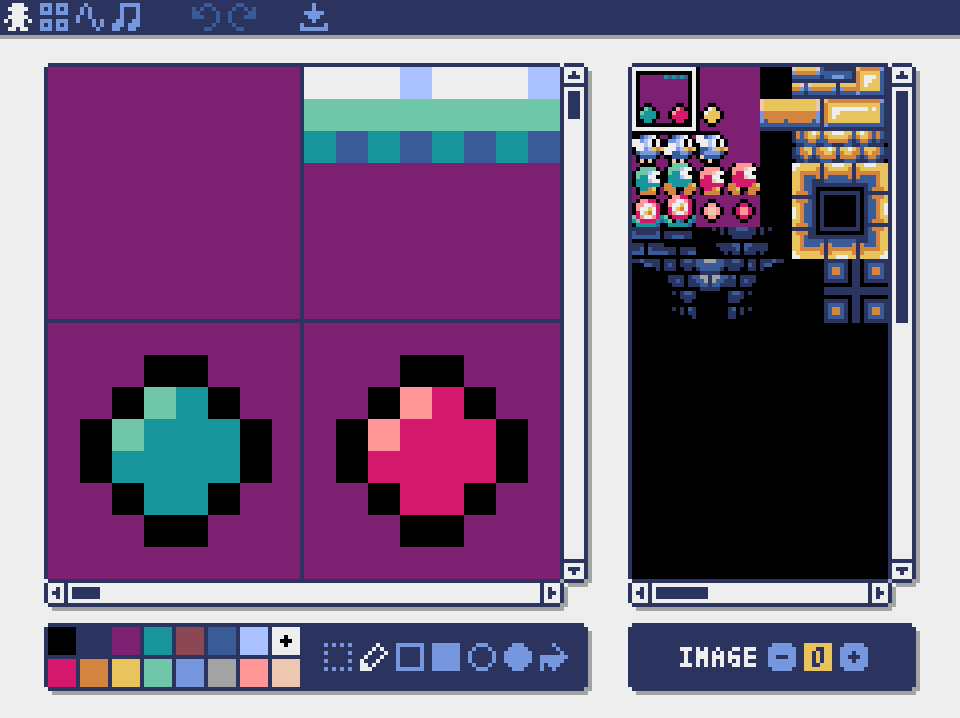
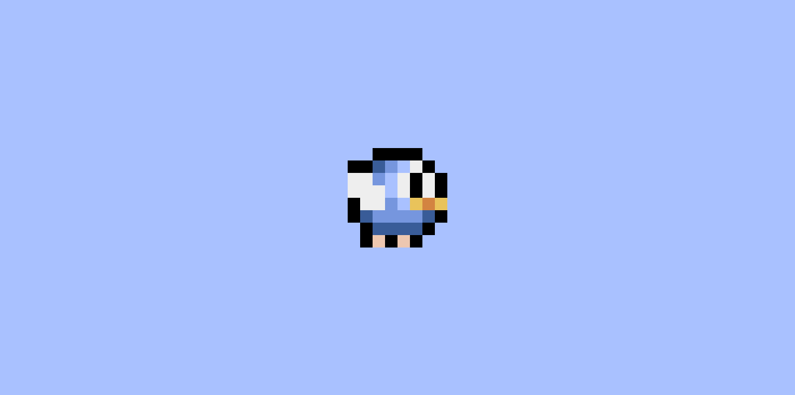
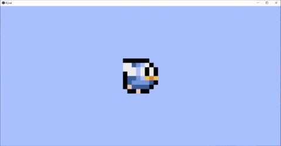

% Making games using Python and Pyxel

I wrote this tutorial for people who are learning Python and are now ready to explore new concepts like object-oriented programming and Python classes. I assume the reader has already learned the [basics of Python programming](https://www.brianlinkletter.com/2020/09/python-the-minimum-you-need-to-know/).

I think that we learn best when working on a practical project. This tutorial will show readers how to build a simple game that they can share with their friends. While building the game, I will introduce the Pyxel game framework and will use Python classes to build and manage multiple game elements.

# Python Classes

A [Python class](https://docs.python.org/3/tutorial/classes.html) is a new type of Python object used in [object-oriented programming](https://www.freecodecamp.org/news/object-oriented-programming-in-python/). Programmers create instances of classes, by [instantiating](https://realpython.com/python-class-constructor/) a class, and then use or modify those instances' attributes in their programs. 

Each instance of a class is a unique object that may contain data, called attributes, and functions, called methods. 

Each class also contains an initialization function, called a constructor, that runs when a new instance is created. The constructor defines the initial state of the instance, based on code defined in it and any data that may be passed into the instance, when it is created.

To demonstrate the simple use of Python classes, you will build a game using Python and the Pyxel framework. You will use Python classes and learn [fundamental object-oriented programming concepts](https://realpython.com/python3-object-oriented-programming/) such as inheritance[^1]. 

[^1]: I ignore more complex object-oriented concepts such as [composition and interfaces](https://realpython.com/inheritance-composition-python/). Object inheritance is suitable for simple-to-intermediate complexity programs and is relatively easier to understand. It is also the correct way to manage objects in the game we will create because each subclass we create has an "is a" relationship to the parent class.


# The Pyxel Framework

[Pyxel](https://github.com/kitao/pyxel#) is a retro game engine for Python. I chose Pyxel for this tutorial because it is simpler than other game frameworks so you can learn enough about it in a short period of time to start building a simple game.

Pyxel makes it easier for programmers to develop pixel-based games that remind you of old games from the 1980s and 1990s. Pyxel provides a set of functions that do most of the work of managing the game loop, displaying graphics, and playing sounds. Pyxel also offers the Pyxel Editor: an all-in-one solution for creating sprites, tiles, tile maps, sounds, and music for Pyxel games.

The [Pyxel web page](https://github.com/kitao/pyxel#) contains everything you need to know about using Pyxel and the Pyxel Editor. The Pyxel framework is relatively simple and the documentation is compact and clear.

> Please stop here and read the [Pyxel documentation](https://github.com/kitao/pyxel#). Then, continue with this tutorial. It will take about ten minutes to read the documentation.

After that, if you would like to spend some more time learning about Pyxel before or after proceeding with the tutorial, you may look at the following resources:

* Work through the [official Pyxel examples](https://github.com/kitao/pyxel#try-pyxel-examples). Pyxel's developer, [Takashi Kitao](https://twitter.com/kitao), [recommends](https://discord.com/channels/697925198992900106/697925198992900109/930086207239622666) working through the Pyxel examples in the following order: 1, 5, 3, 4, 2, 9, and 10.
* [CaffeinatedTech](https://twitter.com/CaffeinatedTech) produced a [2-hour video walking through the basics of Pyxel](https://youtu.be/Qg16VhEo2Qs) while building a snake game.
* [Emanoel Barreiros](https://twitter.com/ebarreiros) wrote an excellent blog with nine [posts about using Pyxel](https://emanoelbarreiros.github.io/game/snake/snake-1/). The first post is in English and the remaining are in Portuguese but you can [translate](https://kinsta.com/blog/how-to-translate-a-website/) them in your web browser.

If you find you enjoy working with Pyxel, you may wish to join the Pyxel community on the [Pyxel Discord server](https://discord.com/channels/697925198992900106/697925198992900109), where you can find information and inspiration.

# Install Pyxel and create environment

To work with Pyxel and follow the examples in this post, first create a [Python virtual environment](https://docs.python.org/3/tutorial/venv.html) and install Pyxel in that environment. Then, install the Pyxel example files so you can re-use some of the assets from the examples in this tutorial. Execute the following commands [^2]:

[^2]: I use a PC running Linux in all the examples. If you are using a Mac or a PC, you will use [slightly different commands](https://docs.python.org/3/tutorial/venv.html#creating-virtual-environments) to launch Python or to activate a Python virtual environment

```bash
$ mkdir learn_pyxel
$ cd learn_pyxel
$ python3 -m venv env
$ source ./env/bin/activate
$ pip install pyxel
$ pyxel copy examples 
```

List the contents of the *learn_pyxel* directory:

```bash
$ ls
env  pyxel_examples
```

The game resources you will use in this tutorial are stored in the *pyxel_examples/assets* directory:

```bash
$ ls -1 pyxel_examples/assets
cat_16x16.png
jump_game.pyxres
noguchi_128x128.png
offscreen.pyxres
platformer.pyxres
pyxel_logo_38x16.png
sample.pyxres
tileset_24x32.png
```

In all the examples below, we will use the assets in the *platformer.pyxres* file because it contains a simple set of sprites. 

Create a new folder for your first game project and copy the resource file into your project folder:

```bash
$ mkdir first_game
$ cp pyxel_examples/assets/platformer.pyxres first_game
$ cd first_game
```

You can view the resource file in the Pyxel resource editor using the following Pyxel command:

```bash
$ pyxel edit platformer.pyxres
```

You should see a new window appear on your desktop that looks like the image below:



This is the [Pyxel Editor](https://github.com/kitao/pyxel#how-to-create-resources). You may use it to view and create sprites, tiles, tile maps, sounds, and music for Pyxel games. 

In these tutorials, we focus on Python programming and using Python classes so we will not cover how to create new assets in the Pyxel resource editor. In this tutorial, you will use the Pyxel Editor to find existing game assets in existing resource files. See the [2-hour video walking through the basics of Pyxel](https://youtu.be/Qg16VhEo2Qs) I previously referenced if you want a good introduction to creating new assets in the Pyxel Editor. 

Quit the editor by pressing the *Escape* key.

# First Pyxel program

Create a small Pyxel program that displays an animation of a bird flapping its wings. In this example, write the program in the procedural style so we can contrast this version to a program written in the object-oriented style, later.

Re-use the bird sprites in the resource file *platformer.pyxres* from the [Pyxel examples](https://github.com/kitao/pyxel#try-pyxel-examples) you downloaded. The three bird sprites are on *Image 0* and are in (x, y) positions (0, 16), (8, 16), and (16, 16). Each sprite is eight pixels high, eight pixels wide, and shows the bird in a different animated position.

First, import the *pyxel* module, initialize the screen size and frame rate (per second), and load the Pyxel resource file *platformer.pyxres*:

```python
import pyxel

pyxel.init(64, 32, fps=2)
pyxel.load("platformer.pyxres")
```

Next, create the *update* and *draw* functions required by the Pyxel framework and pass them into the *pyxel.run* function, which manages the game loop:

```python
def update():
    pass

def draw():
    pass

pyxel.run(update, draw)
```

If you were to save and run this program right now, you would see a new window is created that is twice as wide as it is tall. The window contains nothing because we did not define anything in the *draw* function.

Quit the program by pressing the *Escape* key.

To display one of the bird sprites, change the draw function to the following:

```python
def draw():
    pyxel.cls(6)
    pyxel.blt(28, 12, 0, 0, 16, 8, 8)
```

See the [Pyxel Graphics documentation](https://github.com/kitao/pyxel#graphics) for a description of the *pyxel.cls* function, which clears the screen and replaces everything with a specified color, and the *pyxel.blt* function, which copies a defined bitmap area from the resource file and places is in the Pyxel game screen. If you save and run the program now, you will see the eight-by-eight pyxel bird sprite appears on the screen. This sprite was copied from an eight-by-eight pixel area starting at x and y coordinates 0 and 16 in the resource file's Image 0. On the game screen, the upper right corner of the sprite is placed at x and y coordinates of 28 and 12 on the screen, making it appear like the bird is centered in the screen.

The *pyxel.blt* function has an optional parameter that lets you specify a transparent color on the sprite so it looks better on various backgrounds. In this case, the sprite's background color is [color number 2](https://github.com/kitao/pyxel#color-palette). Add that parameter to the *pyxel.blt* function, as shown below:

```python
def draw():
    pyxel.cls(6)
    pyxel.blt(28, 12, 0, 0, 16, 8, 8, 2)
```

If you save and run the program now, you will see a window similar to the one below:



Now, animate the bird by changing which sprite image is displayed in each frame. Since the three bird sprites are all in a line whose top edge is 16 pixels down from the top if Image 0 in the Pyxel resource file, we just to change the value for the x-position of each sprite in the *pyxel.blt* function.

The usual place to store logic that updates the positions or properties of game elements is the *update* function.

Change the *update* function to the following:

```python
def update():
    bird_sprite_x = 8 * (pyxel.frame_count % 3)
```

The *pyxel.frame_count* increments by one each time Pyxel runs through the game loop. The [modulo operator](https://datagy.io/python-modulo/) leaves the remainder of division so will result in a value of 0, 1, or 2 depending on the frame count. Multiply that by eight and you get a *bird_sprite_x* value of 0, 8, or 16 depending on the frame.

Replace the sprite hard-coded x value in *pyxel.blt* function in the *play* function with the *bird_sprite_x* variable.

```python
def draw():
    pyxel.cls(6)
    pyxel.blt(28, 12, 0, bird_sprite_x, 16, 8, 8, 2)
```

When you save and run the program, you see the first problem you need to solve: Python stops the program with an error because the variable *bird_sprite_x* is not available outside the scope of the *update* and *draw* functions.

One way to solve this is to use global variables, which are accessible in the local [namespace](https://docs.python.org/3/tutorial/classes.html#python-scopes-and-namespaces) of any function that declares them. 

Below, I declared the `bird_sprite_x` variable as a global variable in both functions. This solves the problem, for now, but will get hard to manage as the program gets more complex. Generally, programmers do not want to use global variables to store program state.

Change the *update* and *draw* functions as shown below:

```python
def update():
    global bird_sprite_x
    bird_sprite_x = 8 * (pyxel.frame_count % 3)

def draw():
    global bird_sprite_x
    pyxel.cls(6)
    pyxel.blt(28, 12, 0, bird_sprite_x, 16, 8, 8, 2)
```

Now the program runs, the variable *bird_sprite_x* can be assigned in the *update* function and its value can be read in the *draw* function.

But, the animation is too fast. We could reduce the animation speed by lowering the frame rate but that is not a good solution for the project because it will impact the future versions of the game. 

Managing the speed of game elements relative to the game frame rate is one of the first problems you need to solve in game development. As you add more elements, with different movement speeds and animation speeds, you need a way to control how often a piece of code executes relative to the game's frame rate.

One solution is to create yet another global variable that tracks the sprite frame index. Increment the frame index once every ten frames. When the frame index has incremented to 3, reset it to zero so it can continue to be used to calculate the sprite animations. For example:

```python
bird_index = 0

def update():
    global bird_sprite_x
    global bird_index
    if pyxel.frame_count % 10 == 0:
        if bird_index > 2:
            bird_index = 0
        bird_sprite_x = 8 * bird_index
        bird_index += 1
```

Note that you had to assign a value to the *bird_index* variable in the main body of the program because you must assign a Python variable before you use it. This is OK because, after it the variable is initially assigned, that initialization code does not run again. The Pyxel framework only runs code that is inside the *update* and *draw* functions during the game.

After you save and run the program, the *bird_sprite_x* variable iterates between 0, 8, 16, and back to 0 every ten frames, or third of a second.



You will use this algorithm multiple times when you have different sprites moving at different speeds. You can imagine how complex it will get if you have to manage it with global variables.

# Pyxel program using classes

In many cases, Python classes make it easier to organize and use data in your program. This is evident when we compare the examples above, written in a procedural style, with the examples below, written in an object-oriented style.

The Pyxel documentation [recommends that you wrap pyxel code in a class](https://github.com/kitao/pyxel#create-pyxel-application) so developers can avoid using global variables to pass data from the `update()` function to the `draw()` function in a Pyxel program. If the Pyxel code is wrapped in a class, one can store data in the object instance created when the class is called. That data can be accessed by the rest of the program.

Refactor the first Pyxel program you previously wrote into an program that places the program logic in a class named *App*. See the example below:

```python
import pyxel

class App:
    def __init__(self):
        pyxel.init(64, 32, fps=30)
        pyxel.load("platformer.pyxres")
        self.bird_index = 0
        pyxel.run(self.update, self.draw)

    def update(self):
        if pyxel.frame_count % 10 == 0:
            if self.bird_index > 2:
                self.bird_index = 0
            self.bird_sprite_x = 8 * self.bird_index
            self.bird_index += 1

    def draw(self):
        pyxel.cls(6)
        pyxel.blt(28, 12, 0, self.bird_sprite_x, 16, 8, 8, 2)

App()
```

You defined a class named *App*. In it, you defined the *constructor* method, named *__init__*, which [initializes an instance](https://docs.python.org/3/tutorial/classes.html#class-objects) of the *App* class in a known state. Since the class does not have any parameters, other than the *self* parameter, the initial state will be the same in every time the class is called, or instantiated. The program calls the class when it is run.

The [*self* parameter](https://www.digitalocean.com/community/tutorials/how-to-construct-classes-and-define-objects-in-python-3) represents the instance of the class that will be created when it is instantiated, or called. This object is passed into every method in the class so that all variables in the class are accessible to all the class's methods, such as the *update* and *draw* methods. This eliminates the need for global variables because all variables are now attributes of the *self* object.

Another benefit of using classes is realized when you create multiple instances of the same class. For example, you can define a `Bird` class, which separates all the logic and data associated with the bird sprites from the main program, and create multiple instances of birds on the screen, each with its own position data.

```python
import pyxel

class Bird:
    def __init__(self, x, y, index):
        self.bird_x = x
        self.bird_y = y
        self.bird_index = index

    def update(self):
        if pyxel.frame_count % 10 == 0:
            if self.bird_index > 2:
                self.bird_index = 0
            self.bird_sprite_x = 8 * self.bird_index
            self.bird_index += 1

    def draw(self):
        pyxel.blt(self.bird_x, self.bird_y, 0, self.bird_sprite_x, 16, 8, 8, 2)
```

The *App* class is now simplified because it does not need to manage the state of each bird sprite. When the *App* class is called, it's initialization method instantiates two bird sprite objects by twice calling the Bird class with different parameters. Then we just call the bird sprite objects' *update* and *draw* methods in the *App* class during each game loop cycle, or frame.

```python
class App:
    def __init__(self):
        pyxel.init(64, 32, fps=30)
        pyxel.load("platformer.pyxres")
        self.bird1 = Bird(6,6,0)
        self.bird2 = Bird(28,12,1)
        pyxel.run(self.update, self.draw)

    def update(self):
        self.bird1.update()
        self.bird2.update()

    def draw(self):
        pyxel.cls(6)
        self.bird1.draw()
        self.bird2.draw()

App()
```

You see in the example above, each bird object is initialized with data parameters representing its *x* and *y* coordinates on the game screen, and the animation index. When you run the program, you see two birds on the screen in different locations, with each bird seeming to flap it's wings at different times because each bird starts its animation sequence at a different frame set by the animation index.. 

You can easily add yet another bird, with its own position and animation index, with just one line of code in each of the *App* class's *update* and *draw* methods. You could add a *for* loop that creates hundreds of bird sprites and saves them in a list. Then, you could update and draw those sprites by iterating through the sprite list in each of the *update* and *draw* methods. 

We could further extend the Bird class to include methods that change its position on the screen as time passes and to detect and respond to other game elements. All the information about position, speed, animation is managed separately by each instance of the Bird class so it is possible to manage many birds in the same program.

For example, if we change the *App* class as shown below, we can generate a dozen bird sprites in random locations on the screen:

```python
class App:
    def __init__(self):
        pyxel.init(64, 32, fps=30)
        pyxel.load("platformer.pyxres")
        self.bird_list = []
        for i in range(12):
            a = pyxel.rndi(0,56)
            b = pyxel.rndi(0,24)
            c = pyxel.rndi(0,2)
            self.bird_list.append(Bird(a, b, c))
        pyxel.run(self.update, self.draw)

    def update(self):
        for i in range(12):
            self.bird_list[i].update()

    def draw(self):
        pyxel.cls(6)
        for i in range(12):
            self.bird_list[i].draw()

App()
```

Running the program shows twelve bird sprites in random locations around the screen, all flapping their wings independently.

Defining the bird sprite state in the *Bird* class allows us to change the behavior of the bird sprites instantiated from that class without changing the rest of the. For example, if we change the Bird class to make the bird sprites move one pixel in a random direction every ten frame, we change the Bird class to the following:

```python
class Bird:
    def __init__(self, x, y, index):
        self.bird_x = x
        self.bird_y = y
        self.bird_index = index

    def move(self):
        self.bird_x += pyxel.rndi(-1,1)
        self.bird_y += pyxel.rndi(-1,1)
    
    def animate(self):
        if self.bird_index > 2:
            self.bird_index = 0
        self.bird_sprite_x = 8 * self.bird_index
        self.bird_index += 1

    def update(self):
        if pyxel.frame_count % 10 == 0:
            self.animate()
            self.move() 

    def draw(self):
        pyxel.blt(self.bird_x, self.bird_y, 0, self.bird_sprite_x, 16, 8, 8, 2)
```

In this case, you added a *move* method that changes the bird sprite's x and y coordinates by one pixel in some random direction. Then you moved the sprite animation code from the *update* method into its own *animate* method. Finally, you called the *animate* and *move* methods in the modified *update* method.

You did not need to modify the main application class, *App*, to change the behavior of all the bird sprites. You may be starting to see how Python classes and object-oriented programming enable programmers to build objects that can hide information from each other so that the code in one object does not need to know about all the code in another object. 

# Information hiding

[Information-hiding](https://en.wikipedia.org/wiki/Information_hiding) makes it easier for multiple programmers to work together on the same project.

*Information hiding* is also called *encapsulation*. It is usually accomplished by breaking a large program up into smaller files, called modules. Programmers who are working together agree on how code in one module can access code in another module. This agreement is called an *interface*. As long as you do not change a module's interface, you can add or change the rest of the code to improve the functionality of your module, without negatively impacting the functionality of your colleagues' code. 

For example, you can split your current program into two files, or modules, where one file contains all the code for the sprite class, currently called *Bird*, and the other file contains all the main program code, including the Pyxel *App* class. When you combine *information-hiding* concepts with classes you can re-use and *customize* other programmers' code in your program.

For example, split your current program into two files named *sprites.py* and *game.py*. Put the *Bird* class *sprites.py* file and rest of the program in the *game.py* file. Then, generalize the code in both files by renaming the *Bird* class in the *sprites.py* file 


 in the rite your current program


